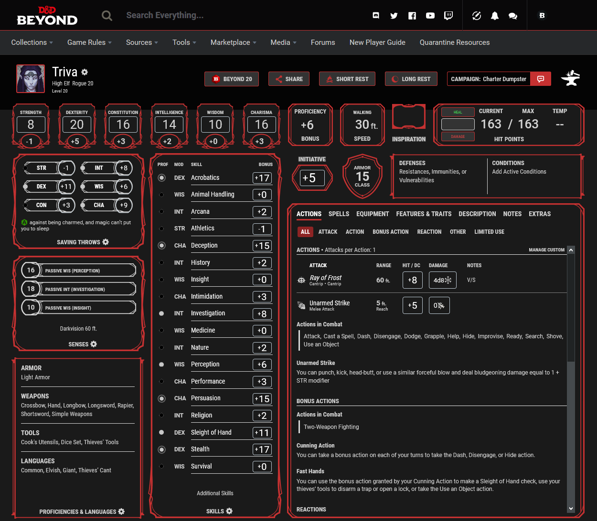

# DnDBeyond_DarkReader_Static
Static Dark Reader theme for DnDBeyond

To use it simply get the Add-On Dark Reader and follow the instructions below. 
It's easier than it seems from the instructions. 
Its dynamic mode also works (mostly) but causes large delays for me so I just made some static CSS for it. 
While I don't know a lot about CSS this works pretty well though I've only properly 
tested it on Firefox and haven't completed a purchase with it yet. 
(partial support for Beyond20 since it can't render on the settings page but the popups will work)

Once you have Dark Reader added:
    1. go to DnDBeyond and click on the Add-On
    2. switch to more
    3. click only for www.dndbeyond.com so it's highlighted
    4. click on static and then the small orange symbol next to it
    5. if it says WWW.DNDBEYOND.COM at the top just paste the CSS from my GitHub in there, press apply and you're done, 
       if it says ALL WEBSITES though continue with the steps below

Only if it says ALL WEBSITES:
    1. click only for www.dndbeyond.com so it's not highlighted
    2. click on static and then the small orange symbol next to it
    3. paste the CSS from my GitHub in there and press apply
    4. close the window and click only for www.dndbeyond.com so it's highlighted (make sure it's still on static afterwards)
    5. switch back to any other tab, click on more and switch back to dynamic

(The order of this can be relevant since there seems to be a bug that requires you to apply it with only for [site] disabled and to then switch back)
Feel free to message me if you find anything that looks weird / isn't converted properly. 
Some of the compendium stuff might not be converted perfectly since I don't have all of it 
(and didn't bother looking through everything). 
Also some things will break when updates to the site come out but I will do my best to keep it up to date.
